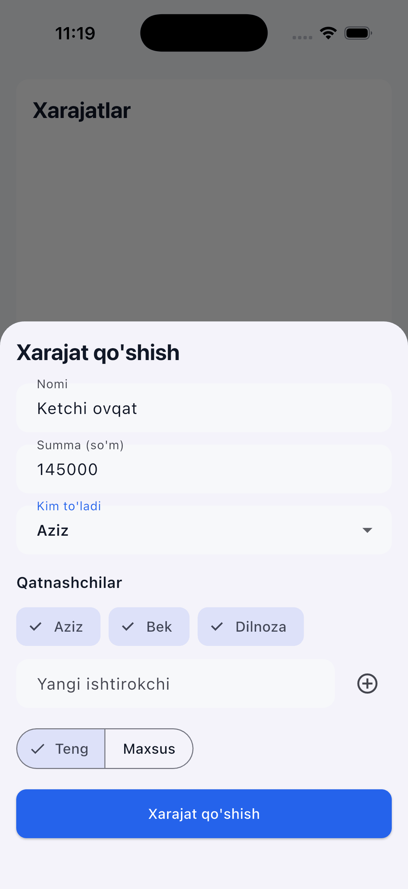
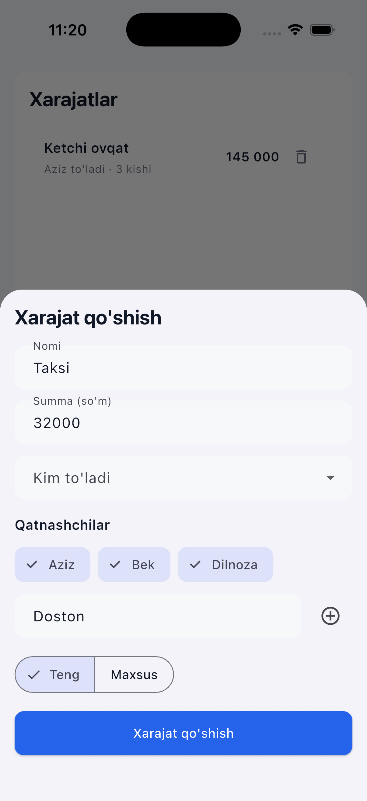
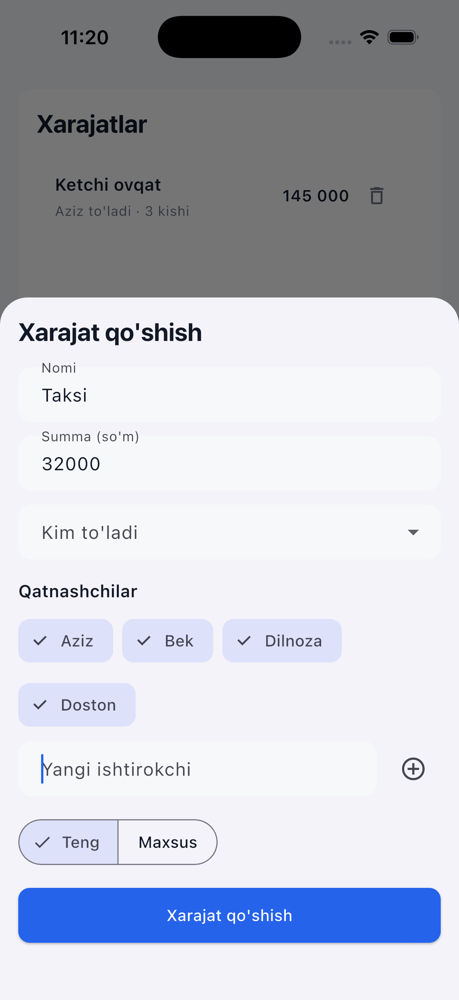
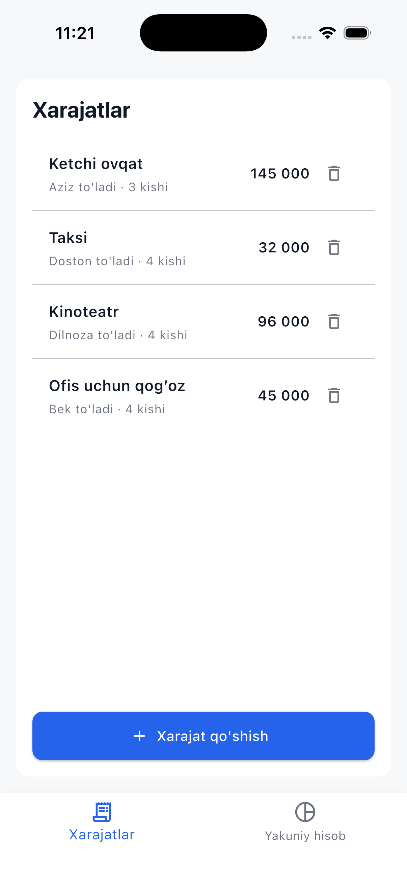
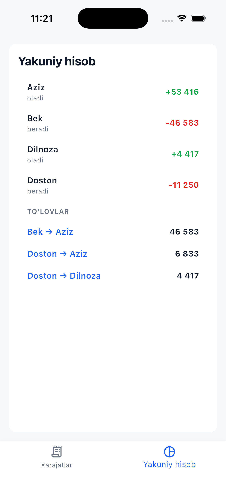

# Hisobni Boʻlishish

Doʻstlar, oila aʼzolari yoki hamkasblar davrasidagi umumiy xarajatlarni qulay va oson taqsimlashga moʻljallangan mobil ilova. Ilova har bir ishtirokchining yakuniy balansini (kim kimga qancha toʻlashi yoki kim kimdan qancha olishi kerakligini) hisoblab chiqadi hamda oʻzaro qarzlarni **minimal oʻtkazmalar soni** orqali yopish uchun optimal tranzaksiyalar roʻyxatini shakllantiradi.

Ilova jami ikkita ekrandan tashkil topgan: **Xarajatlar** (roʻyxatni koʻrish, yeni xarajat qoʻshish, tahrirlash va oʻchirish) hamda **Yakuniy hisob** (ishtirokchilar balansi va optimal pul oʻtkazmalari).

Loyiha [`CLAUDE.md`](./CLAUDE.md) yoʻriqnomasidagi talablarga toʻliq mos keladigan tarzda ishlab chiqilgan: „feature-first“ (funksiyalarga asoslangan) tuzilma, `flutter_bloc`/Cubit holat boshqaruvi (state management) va Material 3 dizayn tizimi.

## Skrinshotlar

Real qurilmada olingan sinov jarayonidan namunalar: yangi xarajat kiritish, jarayon davomida yangi ishtirokchini qoʻshish hamda yakuniy hisob-kitob natijalari.

| Xarajat qoʻshish | Yangi ishtirokchi kiritish | Ishtirokchi qoʻshilgach |
|---|---|---|
|  |  |  |

| Xarajatlar roʻyxati | Yakuniy hisob |
|---|---|
|  |  |

Yuqoridagi misolda: Aziz, Bek va Dilnoza (boshlangʻich uch kishi) ishtirokidagi xarajatlarni shakllantirish jarayonida **Doston** yangi ishtirokchi sifatida qoʻshilgan — buning uchun alohida „Odamlar“ boʻlimiga oʻtmasdan, toʻgʻridan-toʻgʻri shu oynaning oʻzidan foydalanilgan. Toʻrtta xarajat (turli toʻlovchilar va qatnashchilar bilan jami 145 000, 32 000, 96 000 va 45 000 soʻm) yakuniy hisobda uchta minimal toʻlovga („Bek → Aziz“, „Doston → Aziz“, „Doston → Dilnoza“) keltiriladi. Yaʼni toʻrt kishi uchun koʻpi bilan `n-1 = 3` ta tranzaksiya amalga oshiriladi.

## Loyihani ishga tushirish

Loyiha kodini yuklab olgach, ilovani quyidagi buyruqlar yordamida ishga tushirishingiz mumkin:

```bash
flutter pub get
flutter run              # yoki brauzerda sinash uchun: flutter run -d chrome
flutter analyze
flutter test
```

***Eslatma:*** *Ilovada maʼlumotlarni doimiy saqlash (persistence) mexanizmi va server (backend) qismi va’da qilinmagan va joriy etilmagan. Topshiriq shartlariga muvofiq, barcha maʼlumotlar faqatgina ilova ishlayotgan vaqtda tezkor xotirada (RAM) saqlanadi va ilova yopilganda oʻchib ketadi.*

## Arxitektura va papkalar tuzilmasi

Loyiha kodi quyidagi tartibda tizimlashtirilgan:

```
lib/
  core/                          # Ilova mavzusi (theme), masofa/radius tokenlari, pul formatlash yordamchilari va snackbar kengaytmalari
  features/ledger/
    domain/                      # Sof Dart mantiqlari: Person va Expense modellari, xarajatlarni taqsimlash, balans va oʻtkazmalarni hisoblash algoritmlari (UI elementlaridan butunlay ajratilgan)
    data/                        # LedgerRepository interfeysi va uning tezkor xotiradagi (in-memory) realizatsiyasi
    cubit/                       # LedgerCubit va LedgerState (ilovadagi yagona maʼlumot manbayi — Single Source of Truth)
    view/                        # ExpensesView, SummaryView va pastki navigatsiya boshqaruvchisi (LedgerHomePage)
    widgets/                     # Qayta ishlatiladigan UI komponentlari (formalar, chiplar, qatorlar/tile-lar)
test/domain/                     # Biznes mantiq (domain qatlami) uchun yozilgan unit testlar
```

`domain/` qatlami Flutter frameworkiga bogʻlanib qolmagani sababli, unit testlar juda tez va oson bajariladi.

## Holat boshqaruvi (State Management)

Ilova holatini boshqarish uchun **`flutter_bloc` / Cubit** kutubxonasi tanlandi. Ilovadagi maʼlumotlar oqimi asosan oddiy CRUD (qoʻshish, oʻqish, tahrirlash, oʻchirish) amallaridan iborat boʻlganligi sababli, Cubit modeli ushbu vazifa uchun eng maqbul va sodda yechim deb topildi.

Har ikkala ekran ham yagona `LedgerCubit`dan foydalanadi. Ishtirokchilarning balansi va optimal toʻlovlar esa holat (state) ichida saqlab turilmaydi, balki joriy maʼlumotlar asosida **dinamik tarzda qayta hisoblab chiqiladi**. Bu yondashuv maʼlumotlarning eskirishi yoki oʻzaro nomuvofiqligi (desinxronizatsiya) kabi xatolarning oldini oladi.

## Tizim mantiqi va algoritmlar

- **Teng taqsimlash (Equal split):** Umumiy summa guruh ishtirokchilari oʻrtasida dastlab `amount ~/ n` koʻrinishida butun qismlarga boʻlinadi. Qolgan qoldiq esa roʻyxat boʻyicha boshidagi ishtirokchilarga 1 soʻmdan taqsimlab chiqiladi. Bu yakuniy yigʻindining umumiy summaga har doim 100% aniqlikda teng boʻlishini taʼminlaydi (matematik jihatdan isbotlangan va testlar orqali tasdiqlangan).
- **Minimal oʻtkazmalar soni (Debt settlement):** Har bir bosqichda eng katta kreditor (haqdor) va eng katta qarzdor aniqlanib, oʻzaro bogʻlanadi va ulardan birining balansi toʻliq yopiladi (ochkoʻz/greedy algoritm). Bu koʻpi bilan `n-1` ta tranzaksiyani taʼminlaydi va berilgan topshiriq namunasidagi misolni (Aziz: +50 000, Bek: -10 000, Dilnoza: -40 000 → Dilnoza → Aziz: 40 000, Bek → Aziz: 10 000) aynan takrorlaydi.

  **Cheklovlar va kelishuvlar (Trade-offs):** Ochkoʻz (greedy) algoritm har doim ham global miqyosdagi eng minimal tranzaksiyalar sonini kafolatlay olmaydi. Masalan, `test/domain/settlement_calculator_test.dart` faylida bunga yaqqol misol keltirilgan: 6 kishi ishtirokidagi holatda greedy algoritm 5 ta oʻtkazma taklif qiladi, aslida esa qarzni 4 ta oʻtkazma bilan yopish imkoniyati mavjud.
  Tranzaksiyalar sonining mutloq global minimal qiymatini topish NP-hard (murakkab) masala hisoblanib (LeetCode 465 — „Optimal Account Balancing“), u eksponensial vaqt talab qiladigan backtracking (ortga qaytish) algoritmini talab qiladi. Doʻstlar guruhi kabi kichik jamoalar uchun biz tanlagan greedy yechim sodda, juda tez (`O(n log n)`) va real amaliyotda (masalan, mashhur Splitwise ilovasida) keng qoʻllaniladigan eng optimal variantdir. Shuningdek, u topshiriqdagi asosiy talabni („har bir qarzdorni har bir kreditorga alohida bogʻlash notoʻgʻri“) toʻliq qondiradi.

## Loyiha doirasidagi asosiy farazlar (Assumptions)

- **Ekran sarlavhasi:** Dizayn maketidagi „Sayohat“ yozuvi shunchaki namuna sifatida keltirilgan deb hisoblandi. Shu sababli, ekran sarlavhalari sifatida funksional nomlar („Xarajatlar“, „Yakuniy hisob“) tanlandi. Koʻp guruhli (guruhlar roʻyxati mavjud boʻlgan) tizim topshiriq shartlarida soʻralmagan.
- **Boshlangʻich holat:** Tizimda oldindan 3 nafar ishtirokchi (Aziz, Bek, Dilnoza) mavjud boʻlib, xarajatlar roʻyxati boʻsh holatda. Bu topshiriqdagi „boʻsh holat“ (empty state) talabini qondiradi. Yangi ishtirokchini toʻgʻridan-toʻgʻri xarajat qoʻshish oynasidan (sheet) kiritish imkoniyati yaratilgan.
- **Sinxron Repozitoriy:** Barcha operatsiyalar faqat tezkor xotirada (RAM) bajarilishi va kutilmagan xatoliklar yuz bermasligi sababli, repozitoriy qatlamida `Result<T>`/`Failure` oʻramlaridan foydalanishga hojat qolmadi. Validatsiya ishlari Cubit va UI qatlamlarida amalga oshirilgan.
- **Toʻlovchining xarajatda ishtirok etmasligi:** Toʻlovni amalga oshirgan ishtirokchi xarajatdan ulushdor boʻlmasligi ham mumkin (masalan, butun guruh uchun ofis buyumlarini sotib olish) — bu holat balans hisob-kitobida toʻliq qoʻllab-quvvatlanadi (`test/domain/balance_calculator_test.dart`).
- **Doimiy saqlash (Persistence) qoʻshilmadi:** Topshiriq shartlarida maʼlumotlarni doimiy saqlash majburiyati yoʻqligi sababli u amalga oshirilmadi. Biroq, `LedgerRepository` interfeysi tayyor boʻlgani uchun kelajakda mahalliy maʼlumotlar bazasini (Hive, Isar yoki Shared Preferences) ulash juda oson.

## Amalga oshirilgan bonus vazifalar

- **Tahrirlash va oʻchirish imkoniyati:** Yagona `add_expense_sheet.dart` formasi xarajat qoʻshish va uni tahrirlash uchun moslashtirilgan. Xarajat oʻchirilganda, amalni bekor qilish imkonini beruvchi „Bekor qilish“ (Undo) snackbar-i joriy etilgan.
- **Teng boʻlmagan (maxsus) taqsimot:** Ilovada xarajatlarni taqsimlashning „Teng“ va „Maxsus“ rejimlari mavjud. Maxsus rejimda har bir ishtirokchi uchun aniq xarajat ulushi qoʻlda kiritiladi va tizim bu ulushlar yigʻindisi umumiy summaga mos kelishini tekshiradi (`validateCustomShares`).

***Eslatma:*** *Loyiha asosan Google Chrome (Web) brauzerida sinovdan oʻtkazildi, real Android/iOS qurilmalarida yigʻilmadi (chunki loyiha kodi platformalarga bogʻlanib qolmagan sof Flutter kodidan iborat).*

## AI (Claude) bilan ishlash tajribasi

**Asbob:** Loyihani rejalashtirish, kod yozish, testlash va mana shu qoʻllanmani (README) shakllantirishgacha boʻlgan barcha jarayonlarda Anthropic kompaniyasining Claude Code (Sonnet 5) vositasidan foydalanildi.

**AI qayerlarda va qanday ishlatildi:**
- **Dizayndan kodga oʻtkazish:** `task.pdf` tarkibidagi mos namunaviy rasm tahlil qilinib, ranglar palitrasi, masofalar va shrift oʻlchamlari `lib/core/app_theme.dart` va `app_spacing.dart` fayllariga aniqlik bilan koʻchirildi.
- **Biznes mantiq va algoritmlar:** Pullarni aniq yaxlitlash (`expense_splitter.dart`), oʻzaro balansni hisoblash (`balance_calculator.dart`) va optimal toʻlovlarni shakllantirish (`settlement_calculator.dart`) algoritmlari AI koʻmagida yozildi.
- **Refaktoring va debugging:** `flutter analyze` buyrugʻi aniqlagan mayda ogohlantirishlar hamda quyida keltirilgan jiddiy mantiqiy xatolik oʻz vaqtida bartaraf qilindi.
- **Keng qamrovli testlash:** Barcha `test/domain/*_test.dart` fayllari, jumladan, pullarni taqsimlash algoritmining toʻgʻriligini isbotlash uchun oʻta muddatli va murakkab chegaraviy holatlar (0 soʻmdan tortib 1 milliard soʻmgacha, 1 tadan 10 tagacha ishtirokchi) boʻyicha test ssenariylari yaratildi.

**AI qayerda xatoga yoʻl qoʻydi va u qanday tuzatildi (aniq misol):**
Dastlab optimal toʻlovlarni hisoblash algoritmi (`calculateSettlements`) ikki koʻrsatkichli (two-pointer) usul yordamida ishlab chiqilgan edi: qarzdorlar va kreditorlar roʻyxati boshida bir marta kamayish tartibida saralanib, keyin ikki tomondan koʻrsatkichlar siljitib borilardi.

Biroq, AI sub-agenti tomonidan amalga oshirilgan chuqur tahlil shuni koʻrsatdiki, qisman yopilgan qoldiq balans (masalan, dastlabki 100 000 soʻm haqdorlikdan 5 000 soʻm qolgan qismi) navbatdagi ishtirokchilar balansidan kichik boʻlib qolishi mumkin. Ikki koʻrsatkichli usul esa joriy roʻyxat tartibini qayta koʻrib chiqmagani sababli, har bir iteratsiyada joriy „eng katta kreditor va eng katta qarzdorni oʻzaro bogʻlash“ qoidasi buzilayotgan edi. Kod xatosiz ishlashi va standart testlardan muvaffaqiyatli oʻtishi mumkin boʻlsa-da, bu algoritmning asl mohiyatiga toʻgʻri kelmasdi va baʼzi vaziyatlarda ortiqcha tranzaksiyalar yuzaga kelishiga sabab boʻlardi.

**Tuzatish:** Algoritm har bir iteratsiyada qolgan balanslar ichidan eng katta kreditor va eng katta qarzdorni **dinamik ravishda qayta qidiradigan** ishonchli versiyaga oʻzgartirildi (`settlement_calculator.dart`). Shundan soʻng, 6 kishidan iborat murakkab test holati (A: -2000, B: -2000, C: -5000, D: +8000, E: +5000, F: -4000) qoʻlda tekshirilib, kutilgan natija toʻliq tasdiqlandi. Ushbu ssenariy endi `settlement_calculator_test.dart` tarkibida regressiya testi (regression test) sifatida saqlanmoqda.

**AI bilan ishlashda qoʻllanilgan aniq soʻrov (prompt):**
> "Given a mutable map of balances... verify this greedy algorithm against the reference example... try to construct a concrete small counterexample... give a final recommendation: greedy vs exact DFS backtracking."

Ushbu tahliliy jarayon natijasida ochkoʻz (greedy) algoritmni mutloq aniq boʻlgan, ammo juda sekin ishlovchi va murakkab NP-hard backtracking usuliga qarshi solishtirgan holda, **greedy yechimni ongli ravishda tanladim** va buni kod izohlarida hamda yuqoridagi „Tizim mantiqi“ boʻlimida shaffof tarzda (yashirmasdan) hujjatlashtirdim.

## Qoʻshimcha ishlov: dizayn patternlari va CI/CD (keyingi bosqich)

Topshiriq topshirilgandan soʻng, kodni shunchaki „ishlaydigan“ darajadan „diqqat bilan loyihalangan“ darajaga koʻtarish uchun Claude Code bilan qoʻshimcha bir bosqich oʻtkazildi. Har bir qoʻshimcha aniq muammoni yechish uchun tanlandi — hech bir pattern shunchaki koʻrgazma uchun qoʻshilmadi:

- **Mixin** (`core/disposable_controllers_mixin.dart`): uchta vidjetda (`AddExpenseSheet`, `ParticipantSelector`, `CustomSplitEditor`) takrorlangan „`TextEditingController` yaratish → unutmasdan `dispose()` qilish“ andozasini bitta joyga jamladi.
- **DRY**: uchta joyda takrorlangan `listEquals`-asosidagi `buildWhen` tekshiruvlari `ledger_state.dart` faylidagi `ledgerPeopleChanged`/`ledgerDataChanged` funksiyalariga koʻchirildi — „state nima oʻzgarganda hisoblanadi“ degan qoida endi bitta joyda saqlanadi.
- **CI** (`.github/workflows/ci.yml`): har bir push/PR uchun `dart format`, `flutter analyze`, `flutter test` buyruqlari avtomatik ravishda ishga tushadi.

**Sinab koʻrilib, soʻngra voz kechilgan narsalar** (va nima uchun?):
- **Strategy pattern** (`domain/split_strategy.dart` sifatida) — Teng va Maxsus boʻlinish uchun ixtiyoriy `Map<String,int>? customShares` parametri oʻrniga `SplitStrategy` interfeysi (`EqualSplitStrategy`/`CustomSplitStrategy`) sinab koʻrildi. Qayta tahlil qilish jarayonida aniqlandiki, `CustomSplitStrategy` interfeysi oʻzining `amount`/`participantIds` parametrlarini butunlay eʼtiborsiz qoldirar edi — bu ikki realizatsiya aslida bir xil shaklga ega emasligini, demak interfeys haqiqiy abstraktsiya rolini oʻynamayotganini koʻrsatdi. Shuning uchun bu patterndan voz kechildi va oddiy hamda tushunarli boʻlgan `customShares` parametriga qaytildi.
- **Decorator pattern** (`data/logging_ledger_repository.dart` sifatida) — debug rejimida har bir oʻzgarishni logga yozib boruvchi `LoggingLedgerRepository` sinab koʻrildi. Biroq, topshiriqning baholash mezonlarida audit/kuzatuv tizimi soʻralmagani sababli, bu qoʻshimcha kodbazaga ortiqcha hajm va murakkablik qoʻshgani uchun olib tashlandi.

**Loyihaga ongli ravishda qoʻshilmagan narsalar** (va nima uchun?):
- **Factory pattern** — repository'ning faqat bitta haqiqiy realizatsiyasi (`InMemoryLedgerRepository`) bor; shu sababli Factory qoʻshish hech qanday muammoni yechmagan holda faqat murakkablik qoʻshgan boʻlardi.
- **GoF State pattern** (`LedgerState` uchun) — barcha repository amallari sinxron va xatosiz boʻlgani sababli, unda yuklanish (loading) yoki xatolik (error) holatlari umuman yoʻq. Shu bois State pattern bu yerda oʻzini oqlamadi.
- **`Money` qiymat turi** (`int` oʻrniga) — butun kodbaza va testlar boʻylab tarqaladigan ulkan oʻzgarish boʻlardi, vaholanki valyuta oʻzgarmas (faqat oʻzbek soʻmi) va mavjud `int`-asosidagi invariantlar allaqachon testlar bilan toʻliq qamrab olingan.
- **Umumiy test-fixture/builder moduli** — har bir test fayli oʻz `Person`/`Expense` obyektlarini mustaqil yaratadi. Bu kodning ozgina takrorlanishiga olib kelsa-da, testlarni bir-biridan mustaqil va tushunarli qiladi (chunki, umumiy test andozasiga (fixture-ga) kiritilgan oʻzgarish boshqa aloqasiz testlarni kutilmaganda buzishi mumkin — „DAMP over DRY“ testlash falsafasi).

Ushbu roʻyxat ham sun'iy intellekt bilan hamkorlik qilishning bir qismidir: AI'dan nafaqat kod yozish va patternlarni sinab koʻrishni, balki **qaysi yechimlar mos kelmasligini tanib, ulardan oʻz vaqtida voz kechishni** ham soʻradim. Kodning shunchaki ishlashi yetarli emas; har bir qoʻshimcha murakkablik oʻzini oqlashi shart.
